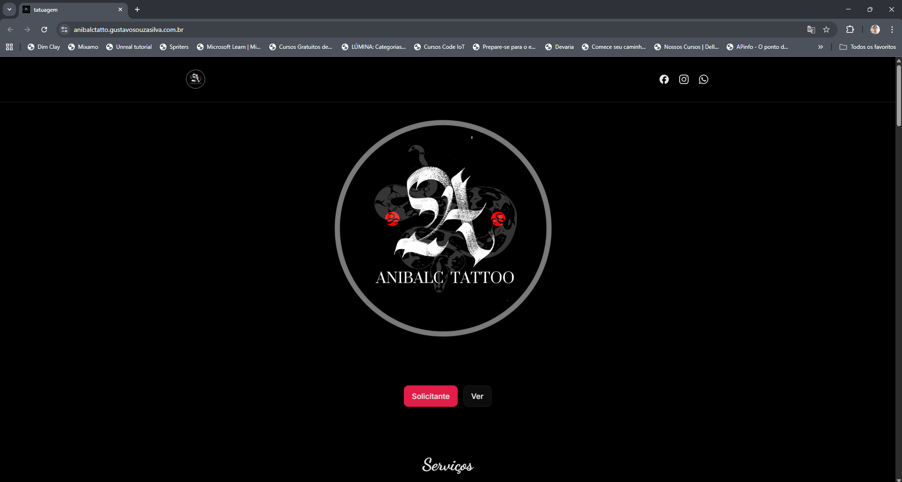

# Tatto Studio — React + Vite
<p align="center">

<p align="center">
  <a href="#-tecnologias">Tecnologias</a>&nbsp;&nbsp;&nbsp;|&nbsp;&nbsp;&nbsp;
  <a href="#-projeto">Projeto</a>&nbsp;&nbsp;&nbsp;|&nbsp;&nbsp;&nbsp;
  <a href="#-layout">Layout</a>&nbsp;&nbsp;&nbsp;|&nbsp;&nbsp;&nbsp;
  <a href="#memo-licença">Licença</a>
</p>

<p align="center">
  
</p>

Aplicação em React com Vite (rolldown-vite), estilizada em CSS, para página de portfólio, serviços e contato de estúdio de tatuagem.

## Requisitos
- Node.js 18+ (recomendado 20+)
- npm (ou pnpm/yarn)
- Windows, macOS ou Linux

## Dependências
Runtime:
- `react@^19.2.0`
- `react-dom@^19.2.0`

Dev/Build:
- `vite@rolldown-vite@7.2.5`
- `@vitejs/plugin-react@^5.1.1`
- `typescript@^5.6.3`
- `@types/react@^19.2.5`
- `@types/react-dom@^19.2.3`
- `eslint@^9.39.1`
- `@eslint/js@^9.39.1`
- `eslint-plugin-react-hooks@^7.0.1`
- `eslint-plugin-react-refresh@^0.4.24`
- `typescript-eslint@^8.12.1`
- `globals@^16.5.0`

CDNs utilizadas:
- Simple Icons (SVGs): `https://cdn.jsdelivr.net/npm/simple-icons@latest/icons/...`
- Imagens externas (Facebook/Instagram): URLs diretas no código.

## Instalação
1. Clone o repositório
2. Instale as dependências:
   - `npm install`
3. Inicie o ambiente de desenvolvimento:
   - `npm run dev`
   - Acesse `http://localhost:5173/`

## Build e Preview
- Build de produção: `npm run build`
- Preview do build: `npm run preview` (servidor estático para conferir `dist/`)

## Scripts disponíveis
- `npm run dev`: inicia Vite em modo desenvolvimento
- `npm run build`: gera build de produção em `dist/`
- `npm run preview`: serve o conteúdo de `dist/`
- `npm run lint`: executa ESLint

## Observações importantes
- O projeto usa imagens e ícones via URLs externas; garanta acesso à internet para carregá-los.
- O link de WhatsApp no header aponta para a API do WhatsApp (`api.whatsapp.com`). O formulário de contato envia um texto para WhatsApp usando `wa.me` com os dados preenchidos.

## Solução de Problemas (Windows/PowerShell)
Se ao rodar `npm run dev` você ver um erro como:
> "npm.ps1 não pode ser carregado porque a execução de scripts foi desabilitada"

Execute o PowerShell como Administrador e rode:
```
Set-ExecutionPolicy RemoteSigned -Scope CurrentUser
```
Depois feche e reabra o terminal e rode `npm run dev` novamente.

## Estrutura do Projeto
- `src/App.tsx`: componente principal e marcações das seções (banner, hero, serviços, sobre, portfólio, depoimentos, contato)
- `src/sales.css`: estilos globais e das seções (layout, animações, ícones, formulário)
- `index.html`: bootstrap da aplicação e favicon
- `vite.config.js`: configuração de Vite com plugin React

## Como rodar em outra máquina
1. Instale Node.js 18+ e git
2. Clone este repositório
3. Rode `npm install`
4. Inicie com `npm run dev` e abra `http://localhost:5173/`
5. Para produção, rode `npm run build` e sirva o conteúdo de `dist/` (por exemplo, `npm run preview` ou um servidor estático).

## Dicas
- Se a porta `5173` estiver ocupada, Vite escolherá outra automaticamente; o terminal mostrará a URL.
- Se algum SVG de ícone não aparecer, confira a URL do CDN e a conexão.
